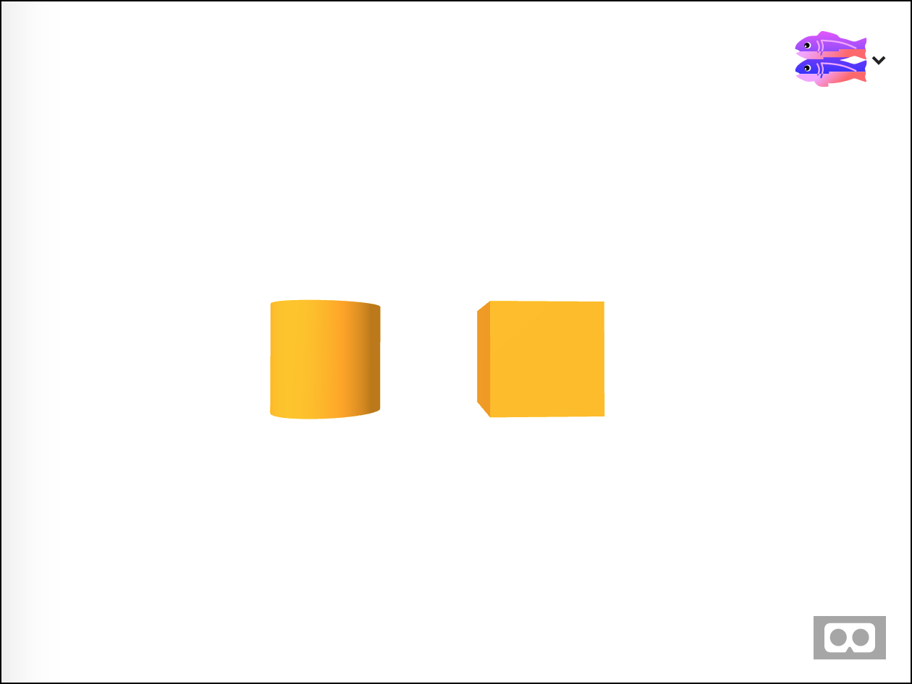
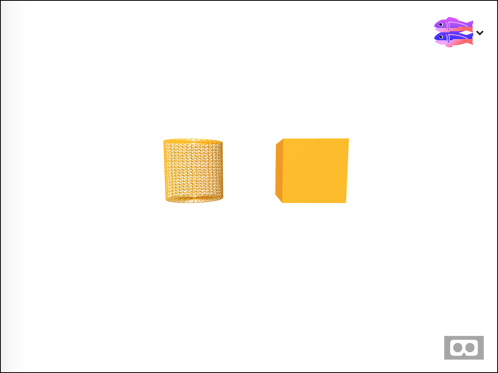
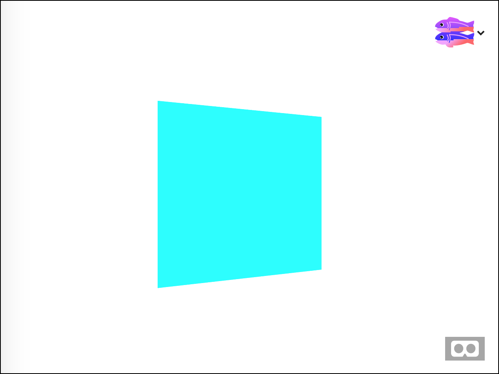
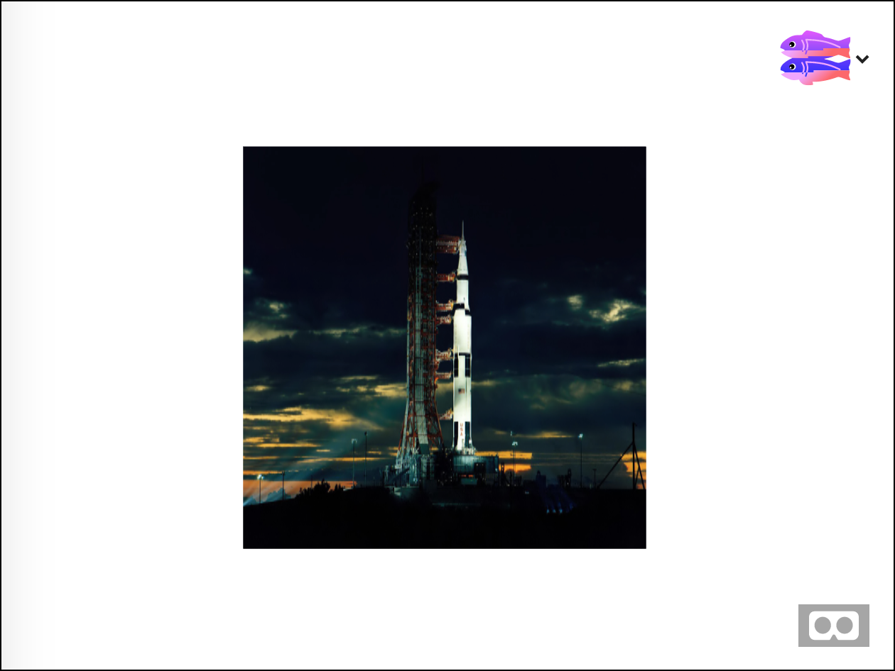
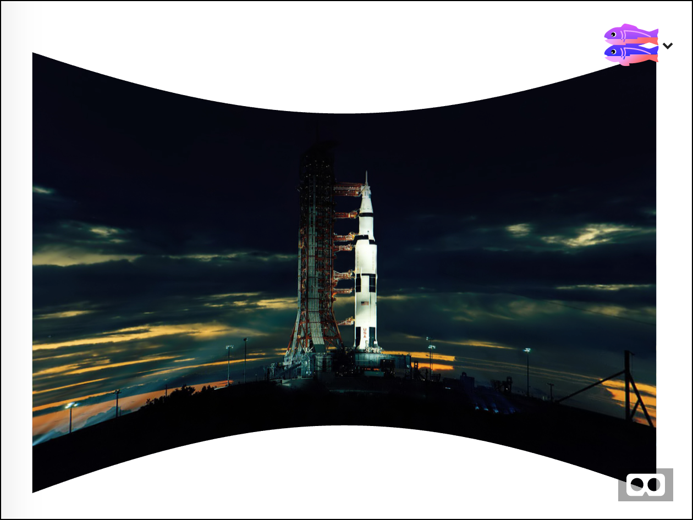
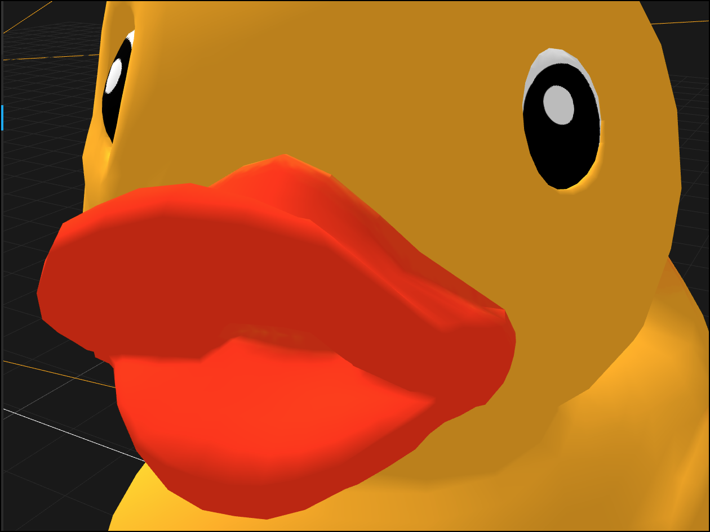

# Basic Geometry

In this lesson you will learn about different kinds of shapes and geometry in A-Frame, a VR toolkit for the web.  If you haven't used A-Frame before please do the [Intro to HTML & AFrame](../intro/README.md) lesson first.

Start by viewing [this](https://webxr-workshop-lesson02.glitch.me/) Glitch project and pressing the fish button to create your own copy. This project shows a scene with a cube and a cylinder in it. It looks like this:



Notice how they are roughly the same size but the cylinder seems smoother. The cube has six faces: the top and bottom and the four sides.  The cylinder also has a top and bottom but only one side; however this one side is curved. It is the *shape* which makes these objects different. This shape is defined by the object's __geometry__.

The cylinder's curved side isn't really curved. In 3D graphics curved surfaces are approximated by using a bunch of flat surfaces. In the case of this cylinder the side is made up of 36 pairs of triangles. Combined with the good lighting the triangles only *appear* to be a single curved surface.

Set wireframe="true" on the cylinder to see the underlying triangles.



You can control how many triangle pairs (*called segments*) are used to approximate the curve. 36 is the default. Set `segments-radial="10"` to use only ten segments. Now the cylinder isn't as smooth because we are using fewer rectangles to approximate the curve.  By using attributes like segments you can control the geometry of the object.

## 2D objects

In A-Frame most objects are 3D, but some are 2D.  What?! How can we have a 2D object in 3D graphics?  Simple: the objects are *infinitely thin*.   

Check out [this demo](https://webxr-workshop-lesson02b.glitch.me/)



As the object rotates you can see that it isn't a cube at all, it is an infinitely thin rectangle. This rectangle is called a *plane*. You can create a plane in with the `a-plane` component.

Here's another idea.  Go back to your project from before.  Add a circle object like this:

```
<a-circle color="tan"
          radius="2"
         position="0 1.5 -5"
         >
  <a-animation attribute="rotation"
               dur="3000"
               fill="forwards"
               to="0 360 0"
               repeat="indefinite"
               ></a-animation>
</a-circle>
```

This is a *circle*, not a sphere. They sort of look the same from head on, but as the circle rotates you can see it is infinitely thin.  Also notice that once we see the backside of the circle *it disappears*. Thats because this circle only has one side!  Yes, in 3D graphics we can create *one sided objects*.

Since we have access to real 3D objects like boxes and spheres why would we ever want to use these 2d objects like planes and circles?  The main reason is *efficiency*.  Suppose I'm writing a game with a floor. The player will only ever see the top of the floor, not the sides or underneath. By using a single sided plane I'm not wasting any memory or CPU cycles keeping track of geometry that will never be used.

## Curved Images

Now lets compare flat vs curved images.  At first glance an image would appear to just be a plane with a picture on it. And in fact, that's basically what it is.



Add this code to your project

```
<a-image
         src="https://vr.josh.earth/assets/2dimages/saturnv.jpg"
         position="0 1.5 -4"
         width="4"
         height="4"
         ></a-image>
```

This image is completely flat. It looks fine from the front but if you move the camera left or right it starts to look a little warped.  If we used a large image the warping will become stronger.  In 3D we often want our images to have a slight curve to them so that they look good even when they are off to the left or right. A-Frame does this with the `a-curved-image` component.

Remove the other objects from your scene and add this one

```
<a-curvedimage
         src="https://vr.josh.earth/assets/2dimages/saturnv.jpg"
         height="4"
         radius="4"
         theta-length="90"
         position="0 1.5 0"
         rotation="0 135 0"
         ></a-curvedimage>
```



Now when you move the camera left or right it still looks good because the image is warped along with the screen. Curved images are perfect for when you need to show several images next to each other that are all seen from the same viewpoint.

Much as the flat image is just a plane with a picture on it, curved images are partial cylinders with pictures on them. While they look similar they have different geometry. Look at both of them with the `wireframe="true"`` so you can see the underlying triangles.  At the end of the day everything in 3D scenes is drawn using a lot of triangles.

## Inside Out Spheres

Let's look back at the sphere.  We've seen spheres from the outside in all of our examples so far.  Add this giant sphere below to your scene.

```
<a-sphere radius="50"
          color="aqua"
          ></a-sphere>
```

Wait, what? Where did the sphere go?  The sphere is single sided. The *outside*.  And currently we are *inside* of the sphere.   Setting the sphere to double sided fixes it.

```
<a-sphere radius="50"
          color="aqua"
          side="double"
          ></a-sphere>
```

## Even More Triangles


Load the MR duck from my assets page. Notice it’s lighting and shadows.

So far everything we have done has used simple shapes like cubes and spheres. These are called graphical primitives, because they are some of the simplest things you can draw.  Let's try something built out of far more triangles: a duck.   

Add this to your project

```
<a-entity
      gltf-model="https://vr.josh.earth/assets/models/duck/duck.gltf"
      position="0 1.5 -4"
              ></a-entity>
```

To build something complex like this duck you can't do it by just adding primitives like cubes together (well, I suppose you *could* do it, but it would be very hard and take a long time). Instead, objects like these are drawn in 3D drawing programs like [Blender](https://www.blender.org) and [Maya](https://www.autodesk.com/products/maya/overview).  They are then exported as GLTF files.

GLTF stands for Graphics Language Transmission Format. GLTF is [a standard format](https://en.wikipedia.org/wiki/GlTF) for 3D objects on the web. Most 3D drawing programs will export models as GLTFs.  The duck above was created by one of the Mozilla Mixed Reality designers.

If you open the A-Frame [Visual Inspector](https://aframe.io/docs/0.8.0/introduction/visual-inspector-and-dev-tools.html) and zoom in you can see that the duck is made of many triangles





## Summary:

Now you have learned that objects are built out of many triangles. These triangles are called the object's __geometry__ and can be created from __primitives__ like cylinders or in 3D drawing programs like Blender. Some objects are actually _2D_, and can have only two sides, or even _one side_.  To see the geometry inside of an object set __wireframe__ to true.

### Enrichment
To play some more with geometry, try these.

* Use some of the more advanced primitives like a [torus](https://aframe.io/docs/0.8.0/primitives/a-torus.html) (a donut shape), a [dodecahedron](https://aframe.io/docs/0.8.0/primitives/a-dodecahedron.html) (a 12 sided ball), or even the [torus knot](https://aframe.io/docs/0.8.0/primitives/a-torus-knot.html) which looks like a pretzel.
* If you have a VR headset, try placing three images in a row using [curved images](https://aframe.io/docs/0.8.0/primitives/a-curvedimage.html) so you can see them as you turn your head.
