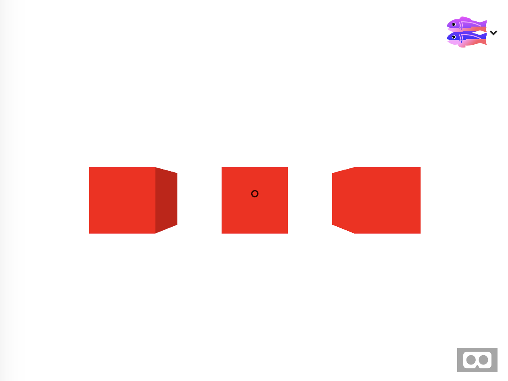

# Input and Events

So far you have learned how to create objects in 3D scenes but you haven’t been able to make the objects do anything. In this module you will learn how to capture user input with gaze and controllers, and how to use events to trigger behaviors.

Start by remixing [this glitch project](https://webxr-workshop-input.glitch.me/). You will see some cubes and a cursor




This scene is already set up for user input. Let’s take a look.

```
    <a-camera position="0 1.6 0">
      <a-entity cursor="fuse: true;"
                position="0 0 -3"
                geometry="primitive: ring; radiusInner: 0.02; radiusOuter: 0.03"
                material="color: black; shader: flat">
        <a-animation begin="click" easing="ease-in" attribute="scale" dur="150"
                     fill="forwards" from="0.1 0.1 0.1" to="1 1 1"></a-animation>
        <a-animation begin="fusing" easing="ease-in" attribute="scale" dur="1500"
                     fill="backwards" from="1 1 1" to="0.1 0.1 0.1"></a-animation>
      </a-entity>
    </a-camera>
    <a-entity laser-controls="hand: left"></a-entity>    
    <a-entity laser-controls="hand: right"></a-entity>
```

Inside of the camera is an `a-cursor` element. This element creates the visible cursor 
using a circle. It is inside of the `a-camera` element so that 
it will always be in the center of the user’s view. When the user focuses on an object, like one of the cubes, 
the cursor will shrink and contract to indicate it is ‘fusing’. When the fuse is complete (usually by hovering 
on an object for more than a second) then the cursor will fire a click event.  
By listening to this event we can trigger some behavior.

You will also notice that inside the cursor are some animations. 
These make the cursor scale in and out to show the fusing effect. You can
replace these animations with your own if you like.

Also notice there is a laser-control in the scene. This is a component that looks for physical 
pointing controllers like the ones that come with most dedicated headsets 
(Oculus Rift, Oculus Go, HTC Vive, Daydream, etc). This controller works similar to a mouse. 
The user can move the pointer cursor/laser over objects and press the trigger button to select 
objects. This controller component will also fire click events.  

By having both a gaze controller and a laser controller our project can work both in headsets 
with controllers and on phones that don’t have controllers.  In both cases the system will fire 
a click event. We just need to listen for it.

Modify the javascript code near the bottom of the page, inside the setup() function, like this

```
function setup() {
	const cube1 = $('#cube1')
	on(cube1,'click',()=>{
		console.log("clicked on the cube")
  })
}

on($('a-scene'),'loaded',setup)
```


The setup function is called once when the page loads.  The $(‘#cube1’) call searches through the page for an element with an id of `cube1`. The `$` function is just a shorthand for `document.querySelector()`, so we don’t have to type as much.

The `on` function attaches an event handler to the cube. `on` is just shorthand for `element.addEventListener(type, callback)`. The code above will listen for the `click` event on `cube1`. When click happens it will invoke the callback function, which in this case just prints to the console: ‘clicked on the cube’.

Load your scene and see if it prints when you click on the left most box (cube1). Remember that this is using the 
gaze cursor, so you will need to drag the scene around to put the cube underneath the gaze cursor and 
leave it there for 1 second to trigger the click.

Of course, printing to the console isn’t very fun. 
Instead let’s change the color of the cube. Modify the callback to look like this:

```
on(cube1,'click',()=>{
  	cube1.setAttribute('material',{color:'pink'})
})
```

Now when you gaze at the first cube it will turn pink.

Since we have three cubes it would be nice to add the same event handler to all three, so 
that they all have this click to change color behavior.

Add a ‘clickable’ class to each cube

```
<a-box class="clickable" id="cube1" color="aqua" position="-2 1.5 -4"></a-box>
<a-box class="clickable" id="cube2" color="aqua" position="0 1.5 -4"></a-box>
<a-box class="clickable" id="cube3" color="aqua" position="2 1.5 -4"></a-box>
```

Then change the code to add an event handler to each of the cubes:

```
$$('.clickable').forEach(cube => {
	on(cube,'click',()=>{
	  cube.setAttribute('material',{color:'pink'})
})  
})
```

Now all of the cubes can turn pink! This is the basics of input. Listen for events and do some action.

### Hover Effects

The built in A-Frame cursors fire several events.  Since we are using `click` it might be nice 
to use `mouseenter` and `mouseleave` to create a hover effect. This 
way the user will know if they are correctly over the object to be clicked.

```
    on(cube,'mouseenter',()=> {
      cube.setAttribute('material',{color:'yellow'})
      cube.setAttribute('scale',{x:1.1, y:1.1, z:1.1})
    })
    on(cube,'mouseleave',()=> {
      cube.setAttribute('material',{color:'aqua'})
      cube.setAttribute('scale',{x:1.0, y:1.0, z:1.0})
    })
```

This code above will change the color to yellow and scale the object up by 10% whenever the cursor enters the object. The second
handler undoes the changes when the cursor leaves the object.

Instead of triggering color changes we could add some simple animation.  Let’s make the cube rotate when you click on it. First add an
animation inside of the cube like this:

```
    <a-box class="clickable" id="cube2" color="aqua" position="0 1.5 -4">
      <a-animation
                   attribute="rotation"
                   to="0 360 0"
                   begin="rotate"
                   ></a-animation>
    </a-box>
```

This animation will begin when it receives the 'rotate' event. This is not an existing event. Instead
when will emit the rotate event when the cube is clicked.

```
on(cube,'click',()=>{
  cube.emit('rotate')      
})
```


Now lets add a sound to play when the cube is clicked.

First add an mp3 file to the `a-assets` section at the top

```
<a-assets>
<audio id="clang" src="https://vr.josh.earth/assets/sounds/clang.mp3"></audio>
</a-assets>
```

Now add the sound to the center cube

```
<a-box
  ...
  sound="src:#clang"
  ...
></a-box>
```

Now just play the sound in the click event handler

```
      cube.components.sound.playSound()
```


### Opportunities for enrichment:
* Provide the student with 8 funny sounds, create drums using cylinders in the scene
* customize the animation for the cursor fusing effect.
* Make cube change color when hover with mouse, but not click

