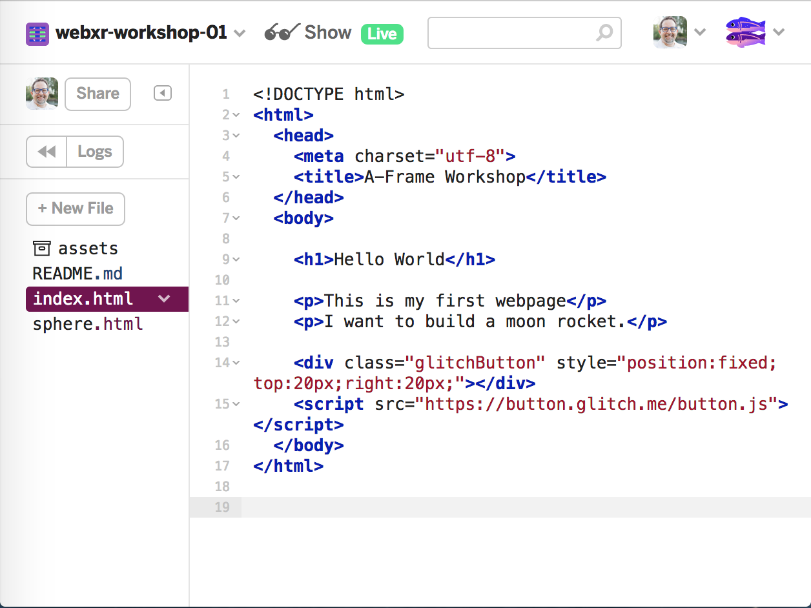
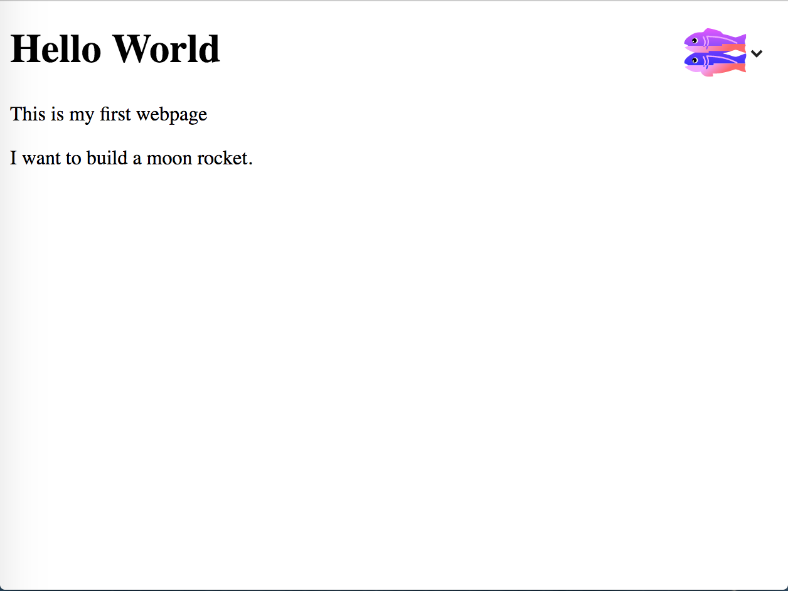
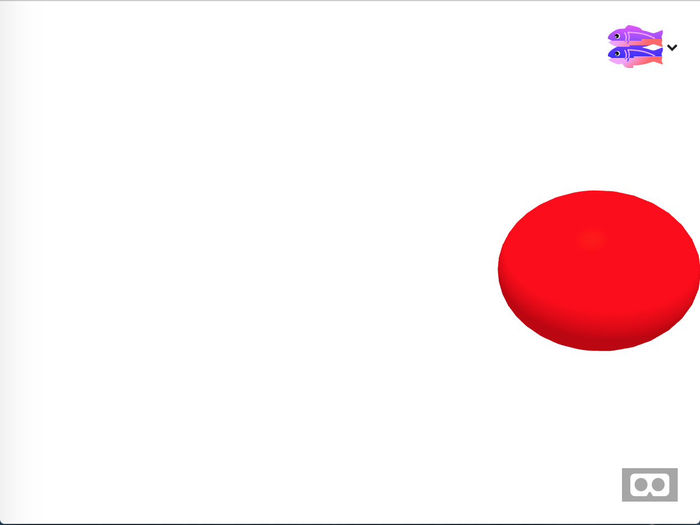
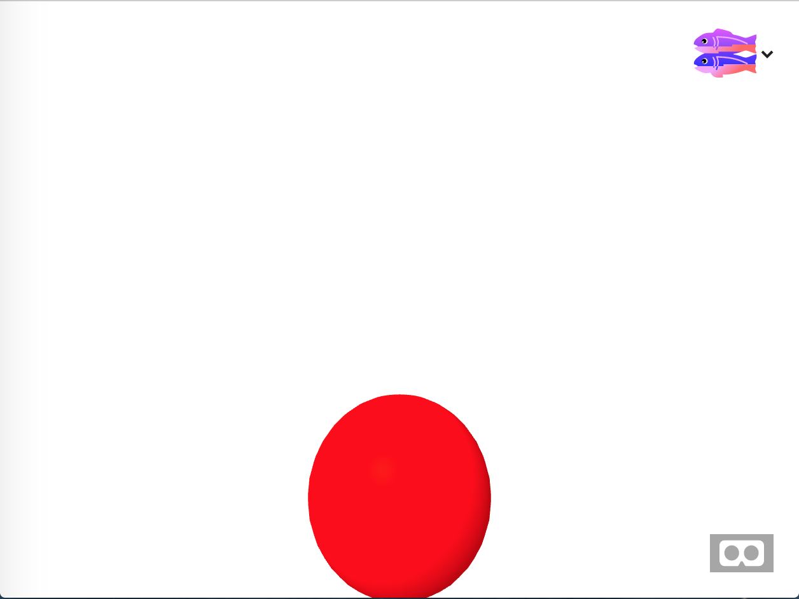
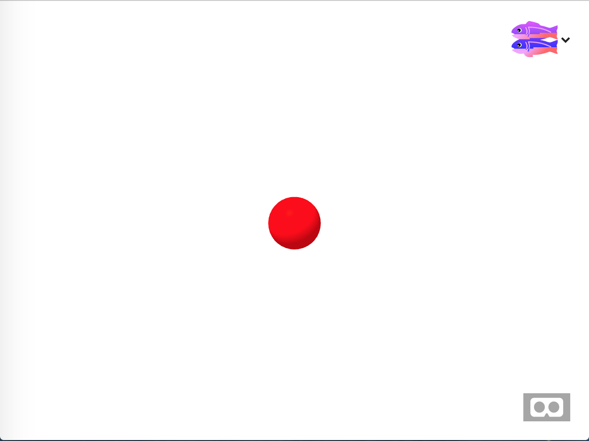
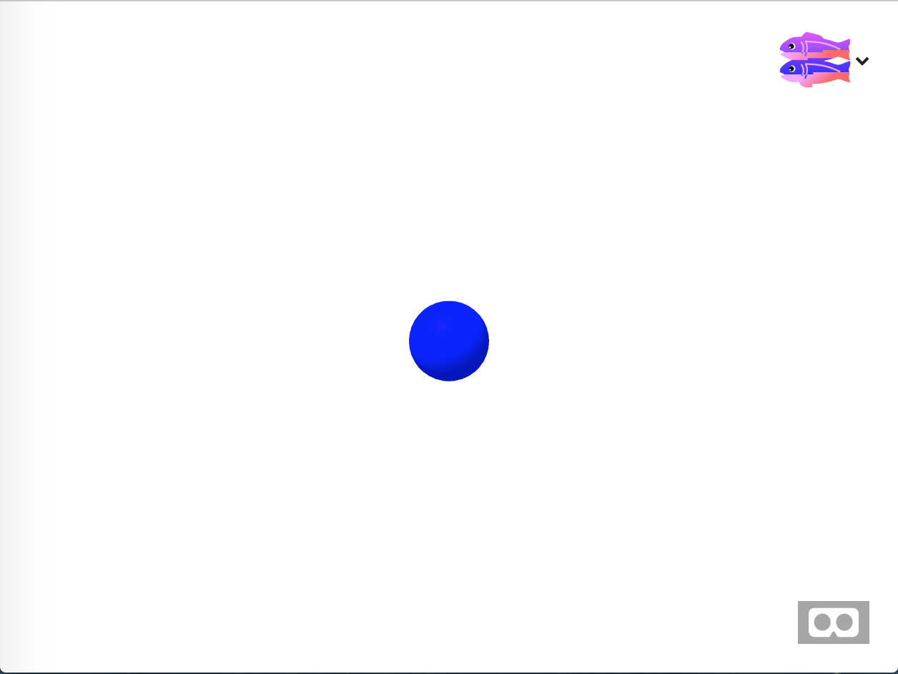
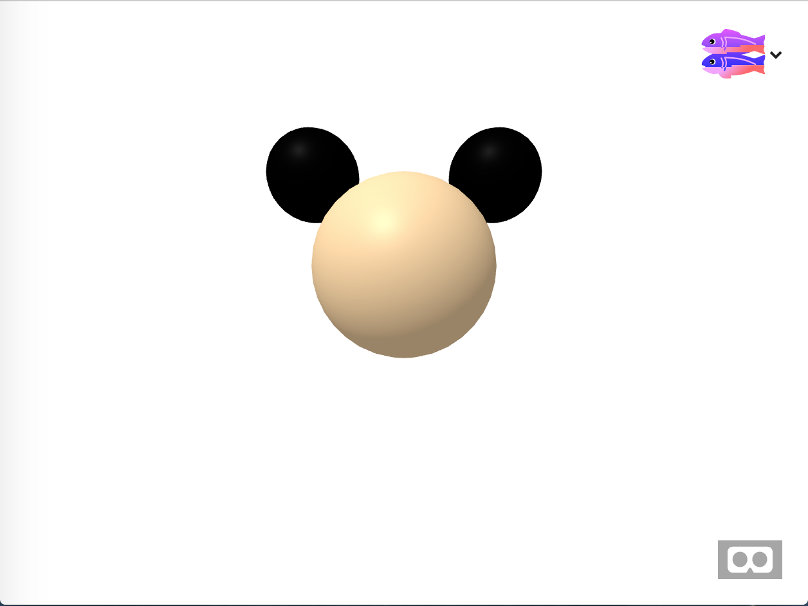

# Introduction to HTML, WebXR, and AFrame

What the student will learn: How markup in the source code translates
into what you see in the final webpage. They will make a simple page with standard html, add an image, then switch to VR mode and add a cube.

# Simple HTML

Go to [this](https://webxr-workshop-01.glitch.me) webpage in a new window or
tab. Click the fish button in the upper right hand corner, then select the `Remix on Glitch` button to create a copy for yourself.  Now select the `index.html` page to see the markup. Now press the *Show* button. This will open a new tab showing the live webpage.







Notice how what you see in the real view looks sort
of like the markup. Headers and paragraphs.

Now go back to the code view. Change the header to
say "Greetings Earthling". Now go back to the live view. It will automatically update. Now you can see 'Greetings Earthling' as the header.

What you have been writing is called HTML, which stands for Hyper Text Markup Language. It is a special kind of computer code used to make webpages.  Those things inside of the angle brackets (< and > symbols) are called HTML *elements*.  Each element corresponds to something in the output document.

If you add more elements to your code, more will show up in the live view. If you change some text, the change will show up in the live view. A web browser is simply a program which converts the markup or source code, into the final webpage that you see when you browse the web.

This is the first big important thing to know about the web: __Web pages are just HTML. Anyone can write a web page and share it with the world.__

## Links

Now go to the paragraph "I want to build a moon rocket". Before the word *moon* insert `<a href='https://nasa.gov/'>` and after the word *rocket* insert `</a>`.  This new element is called a *link*. It uses the name `a` because it stands for an *anchor link*.

The `href` part inside of the angle brackets is called an attribute. An element can have many attributes. In this case, `href` stands for __hypertext reference__.  It makes a link to another webpage.

When you load the live view the text inside of the anchor element will be underlined and clickable. If you click on the link the browser will go to the webpage in the `href`, in this case nasa.gov.

This is the second big important idea of the web:  __The web is made of links from one page to another__.

Let's create our own second page instead of linking to NASA. In the left sidebar click the *New File* button and name the new page `rocket.html`; then click *Add File*.  Inside of that page paste this content:


```
<html>
    <body>
        <h1>My Future Rocket</h1>
        <p>This is the rocket I want to build</p>
        
    </body>
</html>
```

Select the first page from the Glitch sidebar. Change the `<a>` link to point to `./rocket.html` instead of the nasa website: `<a href="./rocket.html">`  Reload the live view. Now when you click on the link it will go to your new page with the picture of the rocket.

This is the third big thing to know about the web. __A website is a collection of web pages with text and media.__

## The 3D Web

So far everything we have made has been a two dimensional text based webpage.  But this course is about how to make 3D graphics and Virtual Reality with the web. Let's create a 3D webpage now.

Go to [this](https://webxr-workshop-lesson01b.glitch.me/) webpage and view it. This page contains a minimal 3d scene of a sphere. You can turn the camera by dragging with your mouse. If you have a phone or VR headset with you, then open this webpage on that device to see it in full 3D.

Now click the remix button in the upper right corner to create your own copy. Let's look at the code in `index.html`

The code looks like this:

```
<html>
  <head>
    <title>A-Frame Workshop</title>
    <script src="https://aframe.io/releases/0.8.0/aframe.min.js"></script>
  </head>
  <body>

    <a-scene>
      <a-sphere
             radius="1"
             color="red"
             position="0 1.5 -4"
             ></a-sphere>
    </a-scene>


    <div class="glitchButton"
         style="position:fixed;top:20px;right:20px;"></div>
    <script src="https://button.glitch.me/button.js"></script>    
  </body>
</html>
```

Like before, every element in the page matches something in the output.  Let's walk through it.

You can ignore the stuff at the top. This is just boilerplate needed to load the 3d library (*a-frame.min.js*) into the webpage, plus the elements that all webpages are required to have. The part at the end is the button that lets other remix the project. The important stuff is in the middle.

The `a-scene` element represents the entire 3D scene. Everything in 3D should be inside of the *a-scene*.

The `a-sphere` element creates the red sphere that we see in the live view. The position is set to `0 1.5 -4`. This creates a red sphere one meter in radius, placed four meters in front of the camera.

## Position

Now change the position from `0 1.5 -4` to `-1 1.5 -4`.  Look at the live view. You should see that the sphere has moved one meter to the left. In 3D, the coordinate system is centered in the screen. The three numbers are called `X`, `Y`, and `Z`.  The X number is zero at the center of the screen and goes negative when you move left and positive to move right.  

Try changing the X value so that the sphere will move to be 3 meters to the right of the center, so it looks like this:



...

Did you change the value to *3*? Your code should look `position="3 1.5 -4"`.

The second value of the position, the *Y* value, represents the up and down direction.  Again, the Y value is zero at the center of the screen. Positive values are up and negative values are down. However, you notice that we've been using 1.5 for Y instead of 0, so far. That's because in VR the camera is set to 1.5 meters high by default, since that's roughly head height. If you wanted to move the sphere to be below your view by two meters, set the Y value to 1.5 -2, which is -0.5.



The third value of the position is called *Z*. It represents how far an object is in front or behind you.  Z is a little confusing because values in front of you are __negative__. That's why the sphere currently has a z value of -4. It is 4 meters in front of you. If you set the z to 4 then you wouldn't be able to see it without turning the camera around 180 degrees.

Try moving the sphere to be 10 meters in front of you. It should look like this




Your position should be `0 1.5 -10`.

## Color

Another component of most objects is the color. The color is actually called the material, since it represents not just the color but also the shininess and which algorithm is used to draw it.  Currently the sphere is red. change it to `blue`. Now it should look like this:



You can use most color names for the color, such as cyan, blue, aqua, gray and [many others](https://developer.mozilla.org/en-US/docs/Web/CSS/color_value).

Much like in many other programming languages, you can also use a hex value like `#ff0000` for red or `#888888` for gray.

So far we have only used one object. Let's add a cube and position it right under the sphere. Move the sphere to 0 1.5 -4, so it's in front of you and 1.5 meters above the center.  Now add a cube by pasting in this code within the `<a-scene>` element:

```
<a-box
       width="1"
       height="1"
       depth="1"
       color="purple"
       position="0 0 -4"
       ></a-box>
```

Now you have a purple one meter cube. Try moving it around, changing the sizes, and the color.  In 3D you can do anything that you want. With just cubes and spheres you can do a lot. Try creating a Mickey Mouse shape with some spheres.



If you'd like to add some other shapes, try the cylinder and the cone.

```
<a-cone radius-bottom="2"
        radius-top="0.5"></a-cone>

<a-cylinder height="3" radius="1.5"></a-cylinder>        
```

### Summary

Now that you are familiar with markup, try the next lesson to learn
about additional shapes you can put into your scene.
