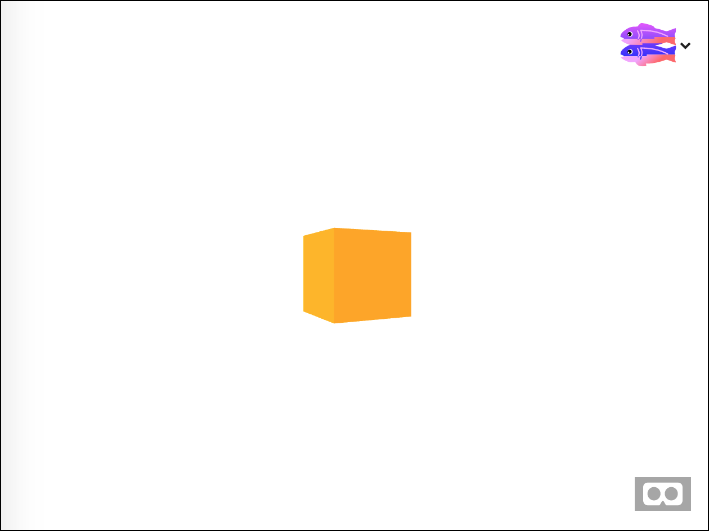
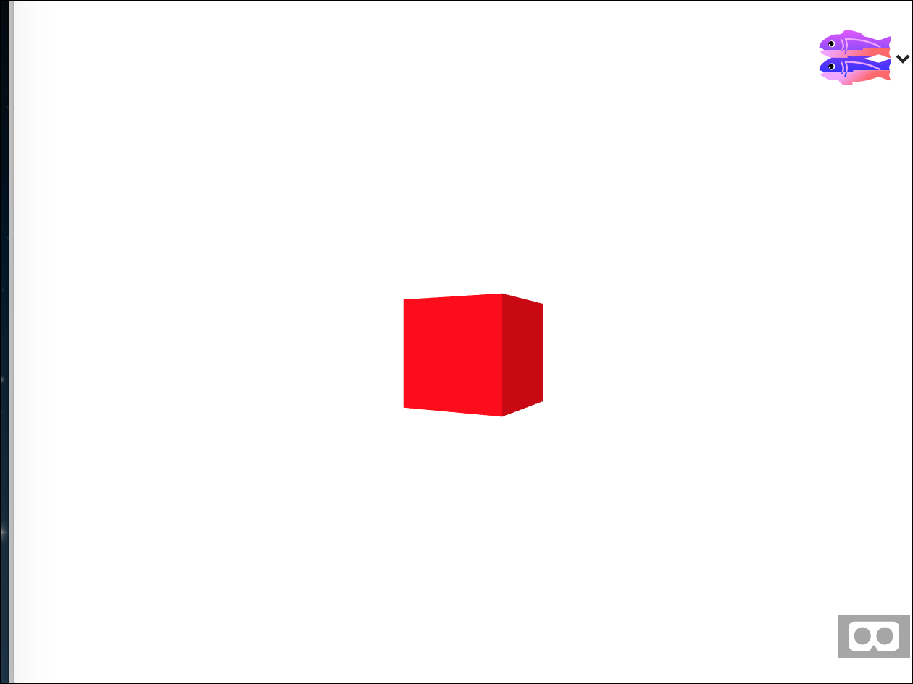
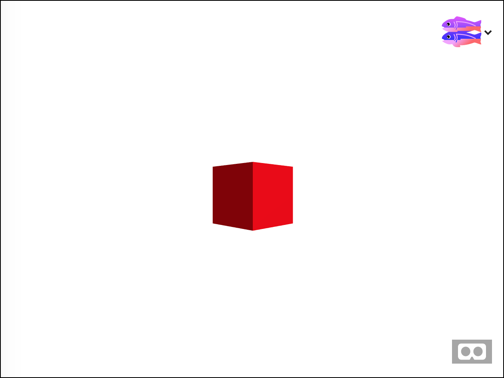
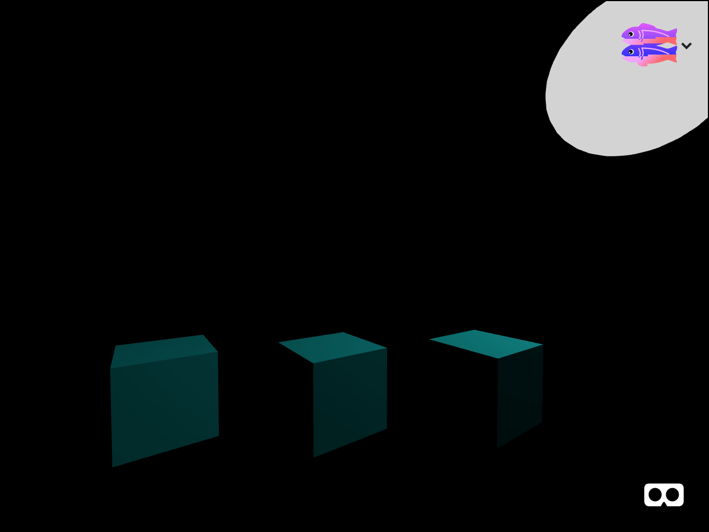
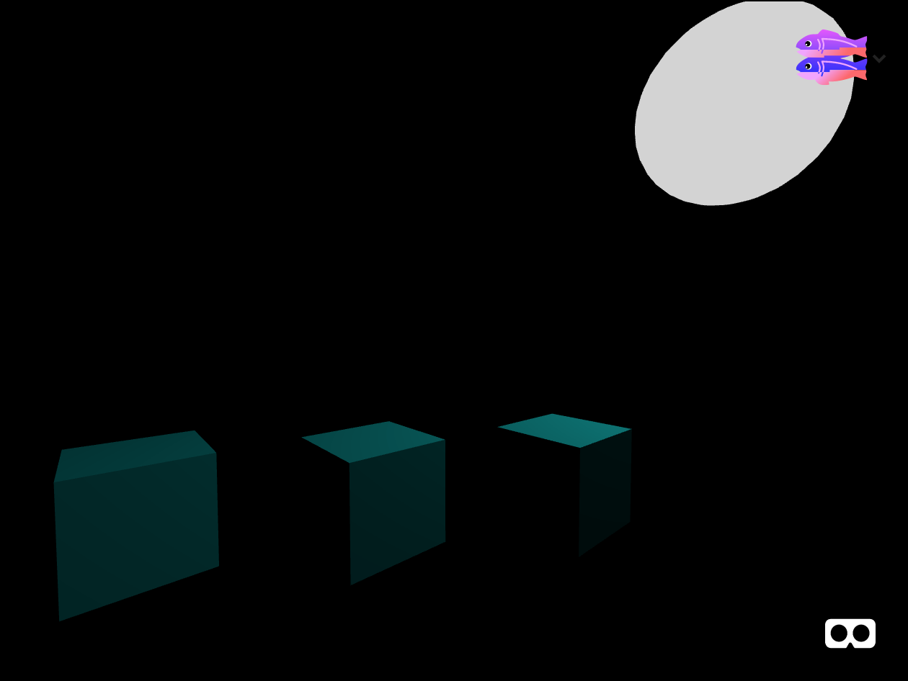
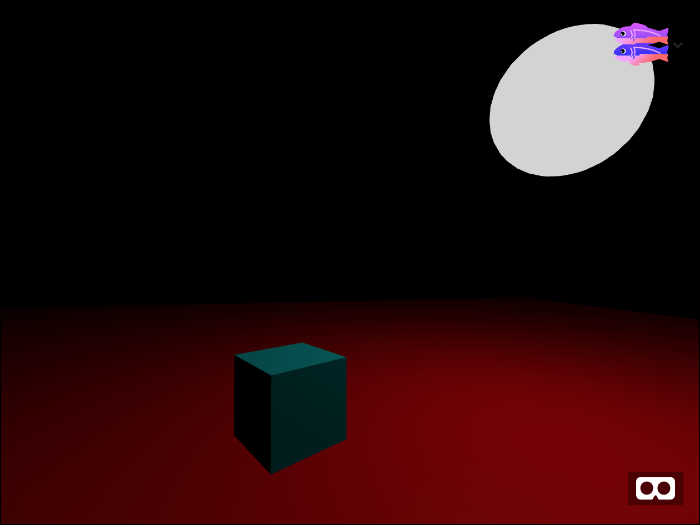
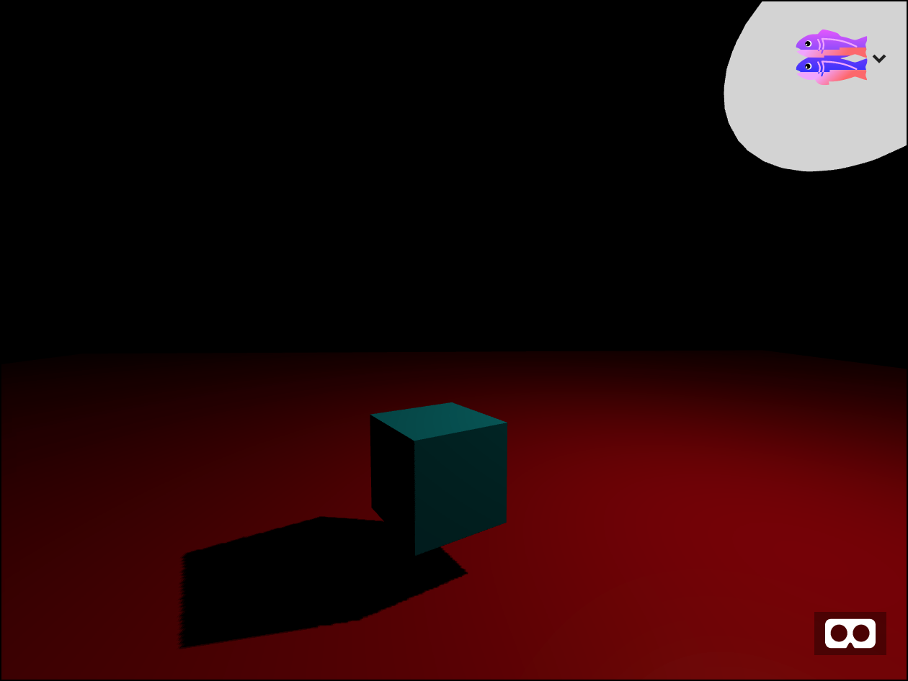

# Basic Lighting & Shadows

In this workshop you will learn how to create and use lights and shadows in A-Frame.  
If you haven't used A-Frame before, please start with the [Intro to HTML and Aframe workshop](../intro/README.md) then come back here.

Look at this project [here](https://webxr-workshop-lighting.glitch.me/).  It contains a single rotating cube. Notice how the brightness of each side of the cube changes as it rotates. That is because there is a light in the scene coming from a particular direction. As the faces of the cube move they reflect more or less brightness from the light.  Now click on the fish button to remix your own copy and look at the code in `index.html`.



Every scene needs a light or else we couldn't see anything. But this page doesn't have a light in it. How is this possible? If you don't add a light then A-Frame will create a default light for you. Since we are going to learn about lights lets create our own. Add this code inside the a-scene.

```
<a-light
         type="directional"
         position="1 1 1"
         color="white"
         ></a-light>
```

This creates a light where the photons stream from the upper right, just behind the viewer's head.  The light affects the brightness of the sides of the rotating cube. Now let's add another light from the left. like this

```
<a-light
         type="directional"
         position="-1 1 1"
         color="white"
         ></a-light>
```

See how the second light brightens up the cube faces on the left side. Light greatly affects how a scene looks, even if the colors don't change.

We often think of lights as being white, but they can actually have any color.  Change the color of the cube to be white and the lights to be red. Now it looks like this:



See how the cube still looks red even though it's really white?  The cube can only reflect the light that hits it. If that light is only red, then it can only reflect red light to your eyes.

The reason the background hasn't changed is because it isn't really a part of the scene. We haven't added a sky or image to be the background, so the default white shows through. The background isn't affected by lighting.

So far we have used directional lights. These are lights which are infinitely far away and point in a particular direction. Directional lights are easy to use and not very expensive (in speed terms).  But there are other kinds of lights.

## Ambient

Let's try an ambient light.  Ambient lights affect all places in the scene, regardless of what direction they are facing. Change your scene to look like this:

```
<a-scene>
  <a-light
           type="directional"
           position="1 1 1"
           color="white"
           intensity="0.5"
           ></a-light>
  <a-light
           type="ambient"
           color="white"
           intensity="0.5"
           ></a-light>
  <a-box
         width="1"
         height="1"
         depth="1"
         color="red"
         position="0 1.5 -4"
         rotation="0 45 0"
         >
  </a-box>
</a-scene>
```



The cube still is brighter on the right side, but the left side never gets completely dark. In the real world objects are never truly in the dark. There is always some little bit of light shining around. To simulate that in VR we can use an *ambient* light. It adds a little bit of light to everything.

Don't overuse ambient light, however. If you set the ambient light to full intensity then other lights will have no affect.

## Point Light and Emissive Materials

So far we have always assumed that lights are these things that we can't see, but which add light to the scene.  And objects are the things which reflect light, but don't create their own. What if we wanted to make an object glow, like the moon?

To make a moon we need to consider two things. First the moon itself should be visible, even if the rest of the scene is pitch black.  Second, the moon also casts light onto other objects in the scene.  To make a moon we need both a sphere for the moon itself and a light for the moonlight.

Here's what we want it to look like.



To make the moon glow we will give it an `emissive` color.  Normally objects in A-Frame only reflect the light that hits them. But with an emissive color they can produce their own light, even if no lights are in the scene.

```
<a-sphere
          radius="1"
          position="4 4 -4"
          color="lightgrey"
          emissive="lightgrey"
       ></a-sphere>
```

The emissive color makes the moon visible, but it doesn't produce light that shines on the rest of the scene. To do that let's add a `point` light *inside of* the moon to shine light on the scene down below.

Point lights are similar to directional lights except that the intensity decreases as objects get further away from the light.

```
<a-light type="point" position="4 4 -4"
         color="gray"
         intensity="1"
         distance="50"
         ></a-light>
```


Then I added three cubes so you can see how the light trails off. The furthest left cube is darker than the furthest right.

The combination of emissive color and a light creates a wonderful nighttime moon feel.



### shadows

Now let's add a plane below the cube so we can see the shadows cast by the cube.

```
<a-plane
         width="40"
         height="40"
         color="red"
         position="0 -1 -4"
         rotation="-90 0 0"
         ></a-plane>
```

It looks like this: *image*



Hmm. The plane and cube are both lit. We can even see the lighting fall off from the point light, but why isn't there a shadow?  It turns out that shadows are very expensive to compute so they are turned off by default. To work with shadows we need to think of three things:

* which light will be used to create the shadow (the moon light)
* which object will cast a shadow (the cube)
* which object will receive a shadow (the plane)

By specifying only exactly the parts that are involved in making the shadow we ensure there is no unnecessary work done. This sort of optimization is not as important for a desktop computer, but it is very important if your scene will be viewed on a mobile device which runs on battery and may have a slower GPU.

To turn on shadows, first change the light from an a-light element
to an a-entity with a light component. Then add castShadow:true.
Due to a bug we can't use the shorthand notation.

```
<a-entity light="type:point;
                 castShadow:true;
                 intensity:1.0;
                 color:gray;
                 distance:50;"
          position="4 4 -4"
         ></a-entity>
```
Now add `shadow="cast: true"` to the cube:

```
<a-box
        width="1"
        height="1"
        depth="1"
        color="aqua"
        position="0 0 -4"
        rotation="0 30 0"
        shadow="cast: true"
        ></a-box>
```

And add  `shadow="receive: true"` to the plane:

```
<a-plane
         width="40"
         height="40"
         color="red"
         position="0 -1 -4"
         rotation="-90 0 0"
         shadow="receive: true"
         ></a-plane>
```

The final scene will look like this:



## Summary

In this workshop you learned about light and shadows. Controlling the light is crucial to making your scenes look interesting.  Without spending some time on lighting your scenes can look flat and boring. Light and shadow control also greatly affects how fast your scene will render on different machines.

## Enrichment:

* So far we have animated only objects. Did you know you can animate lights too? Add this code to the directional light to make it spin around. `add some to animate it code`.
* Try making a shadow using a colored light. What happens? What if you had multiple colors of lights from different angles? What would that look like?
