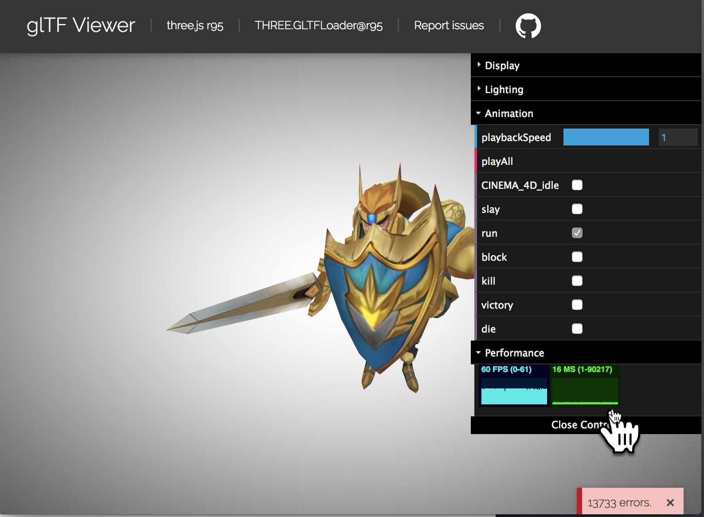

# GLTF and 3D Models workshop

### Introduction
In this workshop you will learn about what 3D models are, how to use them in your projects, and how to animate them.  

### What are 3D models?
You may remember at  the end of the [geometry workshop](../geometry_basic/) that we added a model of a duck using the `gltf-model` component. This model is a collection of geometry objects made up of triangles (a mesh) combined with a texture to 'skin' the model, and any internal animation.  This model is the output of a 3D modeling program like [Blender](), [Maya](https://www.autodesk.com/products/maya/overview), or [Tinkercad](https://www.tinkercad.com/#/).

Everything in VR has geometry. This geometry defines the shape. The geometry may seem like an abstract shape such as a sphere or cylinder, but underneath it is made out of triangles because that is all the computer *actually* knows how to draw.  Using math the A-Frame components like `a-sphere` convert an abstract shape into these triangles.  However, some shapes are too complicated to describe with simple math. Instead these shapes must be drawn using a 3D modeling tool. 

3D modeling tools are very powerful, but they require significant experience to use and the files they output often cannot be used directly on the web. Instead we must convert the models from their native formats to something appropriate for the web: *GLTF*.

## What is GLTF?

GLTF stands for *Graphics Language Transmission Format*. It is a cross vendor format that has become the standard for 3D objects on the web. It is defined by [Khronos](https://www.khronos.org/), the 3D graphics standards organization behind OpenGL and Vulkan. This makes GLTF essentially the JPG for 3D models: a universal standard for web export.

A-Frame and ThreeJS support GLTF natively. While some 3D web frameworks support vendor specific model formats like FXB and OBJ, almost every framework supports GLTF as well.  If someone gives you a 3D model to use, ask them to provide it as a GLTF file.

## Using GLTF files

To use GLTF in your A-Frame project simply reference it as an asset in your scene then attach it to an entity with the `gltf-model` component. 

Remix this [this example glitch project](https://webxr-workshop-gltf.glitch.me/). It contains a single entity with a duck model. The model is hosted on `https://vr.josh.earth/assets/models/`, where Josh has collected several models for you to use.

Once you have a model in your scene you can perform simple animations using the `a-animation` component.  Try making the duck rotate by deleting the existing (duck) entity code and pasting in this code:

```html
<a-entity gltf-model="#duck" position="0 1.5 -4">
  <a-animation 
       attribute="rotation"
       dur="5000"
       to="0 360 0"
       repeat="indefinite"
   ></a-animation>
</a-entity>
```

This will modify the `rotation` property over time. To make the animation shorter or faster change the duration attribute.

`a-animation` can only handle very simple animations. For more complex movement, like animating an object along a path, you can use [Tween.js](https://github.com/CreateJS/TweenJS) or the [aframe-animation-component](https://github.com/ngokevin/kframe/tree/master/components/animation/).  These allow you to chain animations into sequences. However, even these have limits. They can only move or rotate the object as a whole. They cannot move part of an object, such as just the arm of a human model. 

## Internal Animation

Animating only part of the model really requires the animation to be done by the modeling program that created the model. Most of these tools have animation support built in. The person who created the model can add standard animations for actions like run, sit-down, jump, sleep, etc. This is called *internal animation* or *canned animation*.  Then you can play back these canned animations from within your project using another component: Don McCurdy's [animation-mixer](https://github.com/donmccurdy/aframe-extras/tree/master/src/loaders) component from the `aframe-extras` library.

First add the animation mixer component to your project then load up [this](https://vr.josh.earth/assets/models/evil_cauldron/) model of a cauldron.

```
  <head>
    <script src="https://aframe.io/releases/0.8.0/aframe.min.js"></script>
    <script src="//cdn.rawgit.com/donmccurdy/aframe-extras/v4.1.2/dist/aframe-extras.min.js"></script>    
  </head>
  <body>
        
    <a-scene>
      
      <a-assets>
        <a-asset-item id="cauldron" src="https://vr.josh.earth/assets/models/evil_cauldron/scene.gltf"></a-asset-item>
      </a-assets>
```

Now change the entity to use this new model instead of the duck and set a rotation and position so we can see it properly.
```
      <a-entity
                gltf-model="#cauldron"
                rotation="45 0 0"
                position="1.5 1.0 -2"
                >
      </a-entity>
```

Now add the animation-mixer component to the entity like this
```
      <a-entity
                gltf-model="#cauldron"
                rotation="45 0 0"
                position="1.5 1.0 -2"
                animation-mixer
                >
      </a-entity>
```


Cool! now the cauldron is *bubbling*.

*image*

### Multiple Clips

What if the model has more than one animation in it? For example, this model [Hero Knight](https://sketchfab.com/models/30b8847ce37441a2ab7c00b3d5fe4af2) by [iamneuron](link) has several animations for standing, running, slaying, etc.  These are called *clips* and to choose between them you must use the `clip` property of the animation-mixer component.

There's just one problem. Before we can choose a clip we need to find out the *names* of the clips in the model.  We need a tool to inspect the model and give us this information. I highly recommend the [glTF Viewer](https://gltf-viewer.donmccurdy.com/) by Don McCurdy (if you play around with VR on the web for a while you’ll hear Don’s name over and over). 

Download a GLTF file, drag it’s folder to this webpage, then look in the *Animation* section of the controls in the upper right. This will give you the name of each animation and let you try them out.



Once you have figured out the clip you want, just set the clip property in the animation-mixer component like this:

```
<a-entity
 gltf-model="#knight"
 animation-mixer="clip: run"
>
</a-entity>
```

You can see the [live](https://webxr-workshop-gltf-b.glitch.me/) example here. 


## Modifying GLTFs

GLTFs are an output format, similar to JPG and PNG. They are not meant for editing. If you wanted to edit a photo  you might use Photoshop's native file format, PSD, and only export to JPG when you are done. GLTFs are similar. They are an *export* format.  That means we can't easily modify them directly.

There are a few things we can do, however.  While we cannot usually change the materials and colors, we *can* modify the position, scale and rotation of the model.  

Often times a model is not positioned where we want it. You might put the model in the center of your scene, but when you view it the object visually appears to be off to one side. This is because the model was not centered when it was saved. You can fix this with a wrapper.

First, set the position on the model to translate it back to the center. Then add a wrapper entity and use it to position the object. 
It would look like this:

```
<a-entity position="0 0 0">
    <a-entity model="gltf-model"
     position="-10 0 0"
    >
</a-entity>
```

## Binary GLTFs

GLTF files are not actually single files. Instead they are folders containing a JSON document, then some images and other files containing geometry, textures, bump maps, etc.  These other files are all referenced with relative URLS, so normally you can dump the folder on a web server, reference the GLTF file directly, and the rest of the resources will be loaded correctly.

However if you are using a CDN instead of your own web server, you may not have control over relative URLs and they will break. This is the case with Glitch. Instead, you can convert the GLTF to a binary format called GLB, which is a single file containing all of the resources. Then this single file can be put on your CDN and referenced directly.

To get GLB files you can either export them directly from your 3d modeling program or use a tool to convert GLTFs to GLBs. You can use this very nice [web-based converter](https://sbtron.github.io/makeglb/) called MakeGLB by SBTron. Just drag the folder containing your GLTF file to the page, then it will generate and download a GLB file. Next upload the GLB file to the `Assets` section of your Glitch project. Then select the URL of the asset and reference it like this in your main document.

```
      <a-assets>
        <a-asset-item id="cauldron" 
                      src="https://cdn.glitch.com/771e4d82-615a-47d9-83d0-f75e066e28b3%2Fscene.glb?1534877444468"
                      response-type="arraybuffer"
                      ></a-asset-item>
      </a-assets>
      
      <a-entity
                gltf-model="#cauldron"
                position="1.5 1 -1.5"
                rotation="45 0 0"
                animation-mixer
                >
      </a-entity>      


```


*Very important!*  

When you add assets to a glitch project, glitch will append ?numbers to the asset url. This somehow confuses the GLTF loader, which refuses to load it. Remove the `?number` part and it should work fine. Alternatively, add `response-type="arraybuffer"` to the `a-asset-item`, as I did the code above.

## Converting from other formats.

Converting from other formats is best done with the modeling tool that created the model.  Many modelers can already export GLTF or have plugins which can do it.  For example, this *link* is a plugin for Blender which does it.  If your modeler can't export GLTF directly, or if you don't have a copy of the modeling software that created it,  you may be able to use a command line tool to do it.

 [This tool](https://www.npmjs.com/package/obj2gltf) can convert OBJ files to GLTFs and [this tool](https://www.npmjs.com/package/collada2gltf) can convert Collada files. There is also [this tool](https://github.com/cyrillef/FBX-glTF) which can convert FBX files but I found it to be more difficult to use because it uses native code underneath.
  
  I have tried several of these tools and they do an okay job, but sometimes have errors due to differences between the original and destination formats. If you have the original tool the model was made it, always use it’s GLTF exporter instead, if at all possible.

If you need to verify that the generated GLTF file is correct, you can try out this validator: [glTF Validator](https://github.khronos.org/glTF-Validator/)


There is also a big list of converters and other tools on [the official GLTF page](https://www.khronos.org/gltf/)

## Next Steps

As GLTF becomes more popular it is getting easier and easier to find models in GLTF format.  SketchFab will auto convert all models on their website into GLTFs. Try searching for the [#medievalfantasyscene tag](https://sketchfab.com/tags/medievalfantasyscene) which are models that were entered into Sketchfab's competition last year that Mozilla sponsored.

[Google Poly](https://poly.google.com/) is another source of GLTF files.

I have also found a lot of files, especially ones for games, at [OpenGameArt](https://opengameart.org/) and [Kenney's assets](https://www.kenney.nl/assets). Most of these are not in GLTF format, so you will need to convert them.

Learning to use a 3D modeler program is not trivial, and is way beyond the scope of this workshop. However, you can find some good getting started with [Blender](https://www.blender.org/), an full open source 3D modeler, or [Tinkercad](https://www.tinkercad.com/), a free web-based tool from Autodesk for complete modeling beginners.


## Excercises

* position three instances of [this imp character](https://vr.josh.earth/assets/models/imp_character/). Make them dance in sync by wobbling them side to side with `a-animation`.
* find one creative commons licensed model on Sketchfab with has an animation in it. Convert it to GLB, then upload it to the assets of your project and use it.


