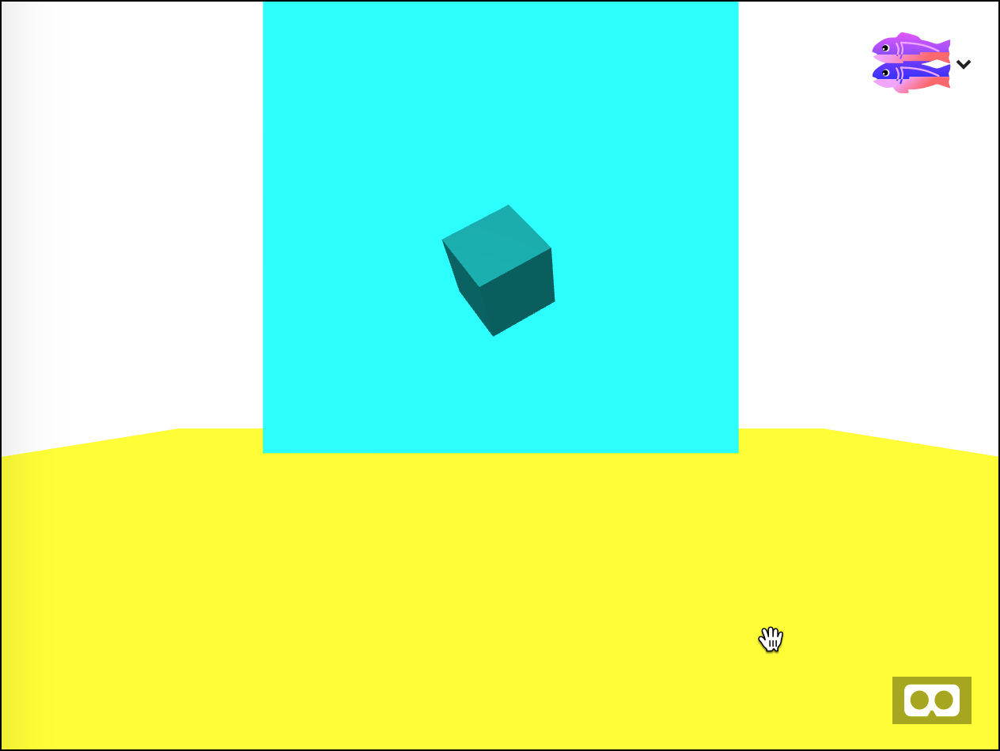
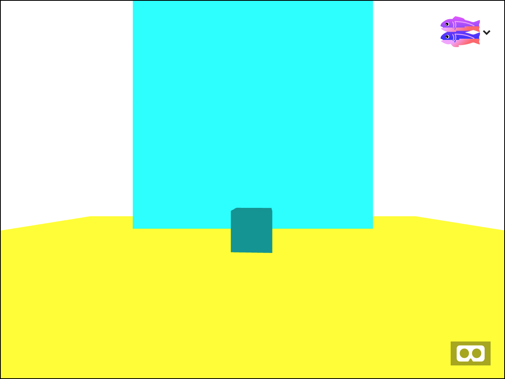
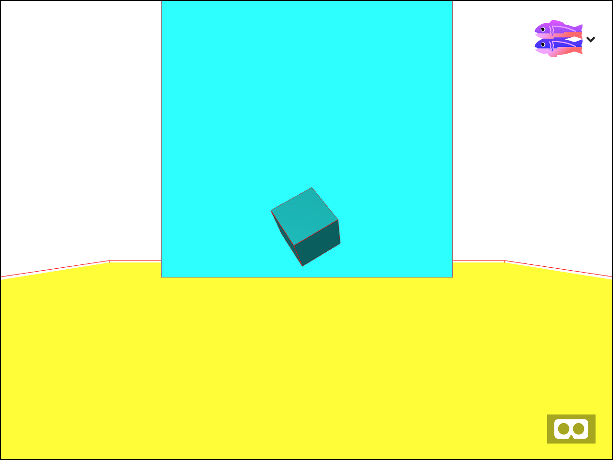
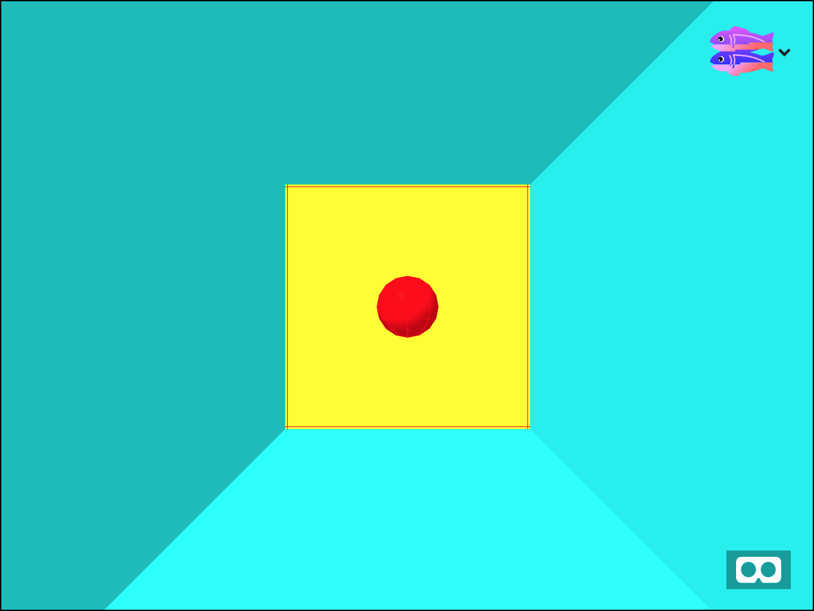
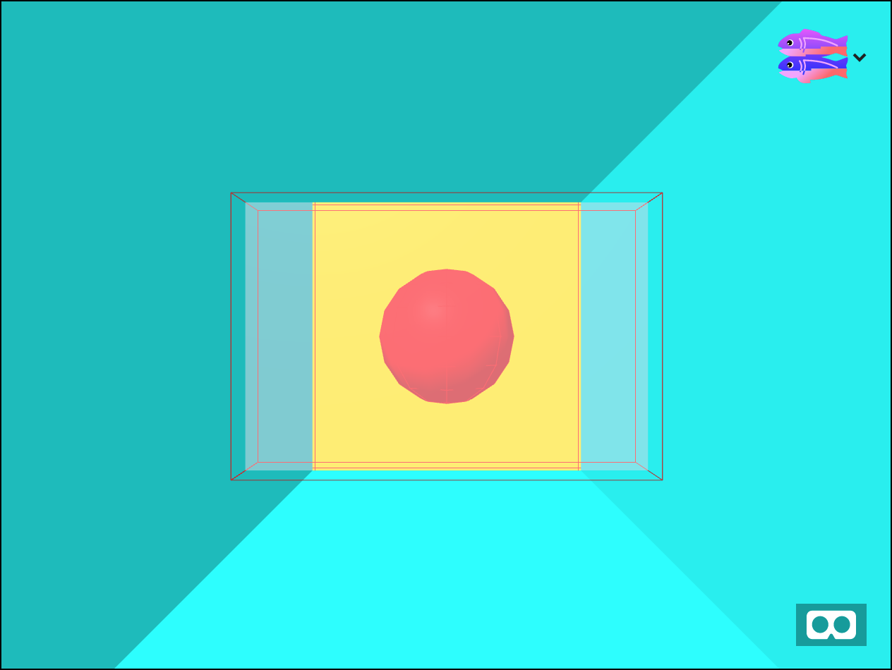
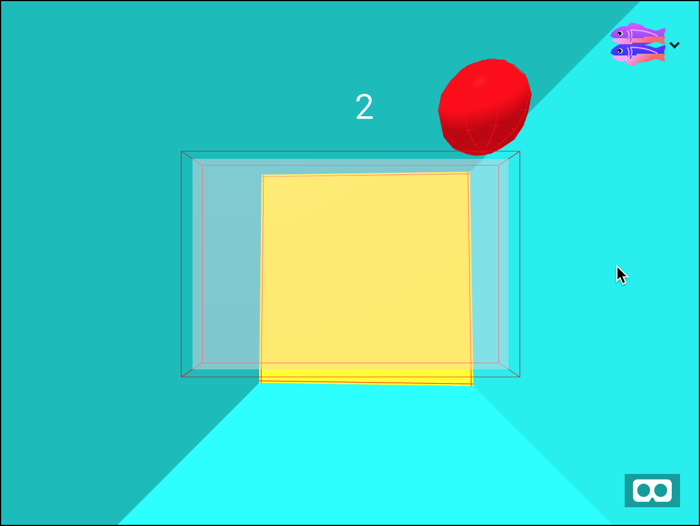

# Physics

Part of simulating reality in a virtual world is not just the colors and lights, but also the way objects move. This is called physics.  VR systems typically have a physics engine which calculates how heavy an object it and how to move it around when it hits other objects.  Physics engines let you create simulations, games, and more. In this workshop we will build a simple ping pong game using a physics engine called Cannon


### A simple scene

Start by remixing [this]() Glitch project. It shows a simple scene of a floor and a large backdrop block, and a cube hovering over the ground. It looks like this:



The cube is hovering it mid-air instead of falling. That is because we don't have physics turned on yet.  Don McCurdy has created [bindings to Cannon.js for A-Frame](https://github.com/donmccurdy/aframe-physics-system). Add them to your scene by adding this to the top of your HTML file, just below the script tag for aframe.

```
<script src="https://cdn.rawgit.com/donmccurdy/aframe-physics-system/v3.2.0/dist/aframe-physics-system.min.js"></script>

```

Now modify the `a-scene` to have a physics component like this:

```
<a-scene stats
         physics="debug:false">      
```

This line will add physics to the scene, but it won't do anything yet. By default objects are not affected by physics,
since physics is expensive to calculate. We must tell the
engine which things need physics in the scene.

Add the `static-body` attribute to the box and the plane.
Add the dynamic-body attribute to the box with the id of 'ball'


```
<a-box
    id="box"
    ...
    static-body
    ></a-box>   
<a-plane id="plane"
    ...
    static-body
    ></a-plane>
<a-box id="ball"
   ...
   dynamic-body
   ></a-box>

```

Now reload the page and the cube will fall down and move around until it settles on the ground.



Now turn on debugging so we can see what's going on.  
Set debug:true on the physics

```
<a-scene
         physics="debug:true">      
```




By adding static-body or dynamic-body to objects you are telling
Cannon that these objects should have physics calculations done on them.  Dynamic bodies have mass, can collide with other objects, and are affected by gravity.  Static bodies can have other bodies collide with them, but they do not move and are not affected by gravity.  In this scene only the falling cube is dynamic. The other two are static. If we had not set static-body on the floor plane then the cube would have fallen right through it!


You can customize the physics for your scene. For example, set the restitution of the scene to 0.1.

```
<a-scene physics="debug:true; restitution:0.1;">      
```

Now the cube will feel heavy because it falls and settles quickly.  Change the restitution to 0.9. Now the cube will bounce around like it is light and made of rubber. It has become very bouncy.  Cannon also lets you affect friction and gravity.

## A Pong Game


Now let's build a simple ping pong game.  Start with [this glitch project](https://webxr-workshop-physics2.glitch.me/).

You will see a room with a ball in it and a yellow back wall. If you turn around you'll see a fuchsia wall behind you.

This scene is actually composed of six planes in addition to the wall. By using planes instead of a single cube for the room we can set the front and back faces to be colored. Also, the Cannon physics engine has trouble calculating when the objects are *inside* of other objects instead of colliding from the outside.



Physics is turned on in this scene but nothing is happening after the ball falls down.  Let's chnge things a bit. first, turn off gravity and set restitution to 1.0 so the ball is super bouncy.

```
<a-scene physics="debug:true; gravity:0; restitution:1.0;">
 ```

Now the ball stops falling. But without gravity how can we get it to move? Simple: apply an impulse.    When the scene is loaded we want the ball to start bouncing around. Add an event handler to run when the scene fires the `loaded` event.
```
on($('a-scene'),'loaded',()=>{
    const ball = $('#ball')
    const pos = ball.getComputedAttribute('position')

    //start the ball moving
    ball.body.applyImpulse(
      new CANNON.Vec3(0, 0, -50),
      new CANNON.Vec3().copy(pos)
    )
})
```


The first argument to applyImpulse is the direction. The vector CANNON.Vec3(0,0,-50) makes the ball go zero in the x and y directions and a speed of 50 in the negative z direction (away from the camera). Now the ball will shoot away from the camera, bounce off the yellow backboard, then zoom towards and through the camera. Since we have no gravity the ball will continue bouncing forever.

Now let's add a paddle. Make a translucent box and place it  inside of the camera like this. The box should be a static-body

```
<a-camera position="0 0 0">
    <a-plane id="paddle"
        width="1.5"
        height="1"
        position="0 0 -1.5"
        static-body
        material="color:pink; transparent:true; opacity:0.5"
   ></a-plane>
</a-camera>
```

Now the ball will bounce between the backboard and the paddle. Because the paddle is translucent we can still see the ball bouncing around. Putting the paddle inside of the camera means it will be *stuck* to the camera and always point straight ahead when the player moves their head.




At this point the game basically works. The player can tilt their head to hit the ball from different angles. However their is no score. In order to calculate the score we need to count the number of times the ball hits the paddle.  This is called a collision. we can detect collisions by listening for collide events on the ball. Add this JavaScript code inside the `loaded` event handler.

```
let count = 0
//collision handler
on(ball,'collide',(e)=>{
    if(e.detail.body.id === paddle.body.id) {
       count = count + 1
    }
})
```

Every object with physics has a unique ID on the body component. By comparing ids we can determine if the ball collided with the paddle or something else.


Now we just need to show the score. Add this `a-text` element inside of the camera, so it will stick to the screen.

```
    <a-text id="score"
            position="0 1 -2"
            value="0"
            ></a-text>


```
And add this to the collide event handler to update the score
whenever the count changes.

```
$("#score").setAttribute('text','value',count)
```



# Next Steps

The cannon physics engine has many other features. By default it knows how to work with planes, boxes, and spheres. If you want to use other kinds of objects you will need to make a custom mesh or merge shapes together for the physics engine to work with. Cannon also supports constraints for things like hinges and fixed distances.
